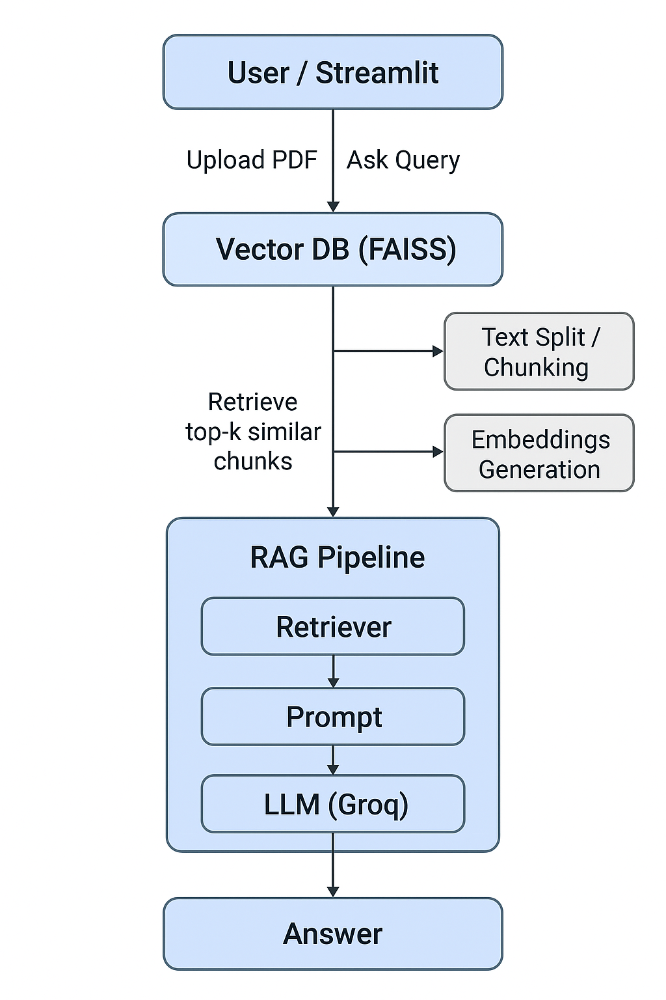

# RAG_Application_LangChain


# 📘 RAG Pipeline with LangChain, LangServe & Streamlit

This project demonstrates how to build a complete **Retrieval-Augmented Generation (RAG)** pipeline using:

- **LangChain** for document loading, chunking, embeddings, and vector store
- **FAISS** for vector DB store and similarity / semantic search
- **LangServe** for deploying an LLM-powered API endpoint
- **Streamlit** as a user-friendly UI to upload documents, build a vector database, and query it

---

                ┌─────────────┐
                │  User / UI  │
                │ Streamlit   │
                └─────┬──────┘
                      │ Upload PDF / Ask Query
                      ▼
              ┌───────────────┐
              │ Vector DB     │
              │ (FAISS)       │
              └─────┬─────────┘
                    │ Retrieve top-k similar chunks
                    ▼
             ┌───────────────┐
             │ RAG Pipeline   │
             │ - Retriever    │
             │ - Prompt       │
             │ - LLM (Groq)   │
             └─────┬─────────┘
                   │
                   ▼
             ┌───────────────┐
             │ Answer / Output│
             │ Display in UI  │
             └───────────────┘


## 🚀 Project Overview
This system lets users:
1. **Upload PDFs or text documents** via a Streamlit UI.
2. **Automatically split** the document into chunks.
3. **Generate embeddings** using SentenceTransformers.
4. **Build a FAISS vector database** and store it locally.
5. **Query the vector DB** using a LangServe-powered inference API.

The overall architecture:
```
Streamlit Client  →  LangServe API  →  RAG Pipeline  →  Vector DB (FAISS)
```


---

## 📂 Project Structure
```
project/
│
├── main.py              # LangServe backend exposing /rag endpoint
├── dbcreation.py        # Utility script to build vector DB manually
├── client.py            # Python client for testing LangServe
├── streamlit_app.py     # Streamlit frontend for upload + query
├── vectorDBstore/       # Auto-created FAISS DB
└── SolarSystem_Arxiv.pdf (example PDF)
```

---

## 🏗️ 1. Backend (LangServe Server)
The LangServe server hosts a **Runnable RAG pipeline** with:
- Document retriever
- Embedding model
- FAISS vector search
- LLM chain to answer questions

To start the server:
```
uvicorn server:app --reload --host 0.0.0.0 --port 8000
```
You should now see:
```
http://localhost:8000/rag/playground
```
This lets you test your RAG API directly from a browser.

---

## 🧠 2. Document Ingestion & Vector DB Creation
`dbcreation.py` loads PDFs, splits them, embeds them, and creates a FAISS DB locally.

Steps:
1. Load PDF using `PyPDFLoader`
2. Split into chunks (`RecursiveCharacterTextSplitter`)
3. Generate embeddings (`sentence-transformers/all-mpnet-base-v2`)
4. Save the database locally:

```
vectorDBstore/index.faiss
vectorDBstore/index.pkl
```
---

## 🖥️ 3. Streamlit Frontend
The Streamlit UI allows users to:
### **Upload PDF files**
- On upload, the system will process & rebuild FAISS DB
- Stores DB in `vectorDBstore/`

### **Ask Questions**
- Streamlit sends queries → LangServe `/rag` endpoint
- Responses displayed in UI

Run Streamlit app:
```
streamlit run streamlit_app.py
```

---

## 🔌 4. Python Client (Optional)
`client.py` lets you test LangServe API without Streamlit:
```python
from langserve import RemoteRunnable
rag = RemoteRunnable("http://localhost:8000/rag")
response = rag.invoke("what is the main sequence star?")
print(response)
```

---

## 🔍 How the RAG Pipeline Works (Internally)
1. Query comes in from Streamlit
2. RAG pipeline retrieves top-k similar chunks
3. Sends chunks + question to LLM
4. LLM generates the final answer

---

## 📦 Requirements
```
langchain
langserve
langchain-community
langchain-huggingface
sentence-transformers
faiss-cpu
streamlit
uvicorn
fastapi
```


## 🛠️ Future Improvements
- Multi-file upload support
- Support for images + OCR
- Persistent database across sessions
- Store multiple indexed projects
- User authentication in Streamlit

