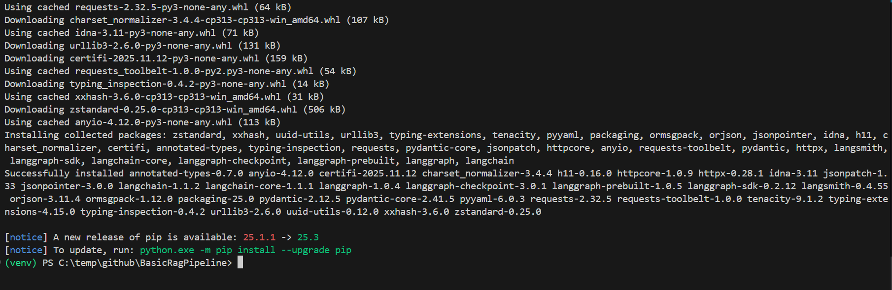
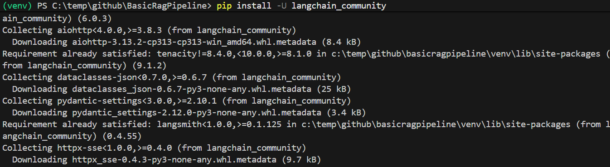
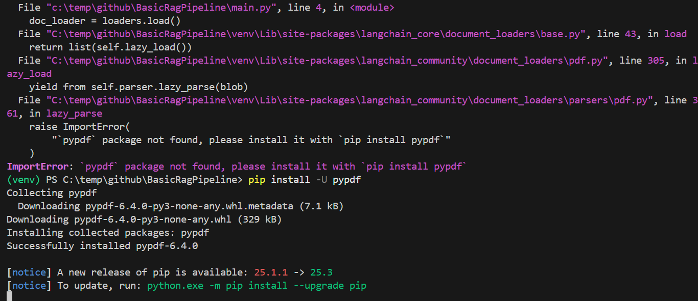
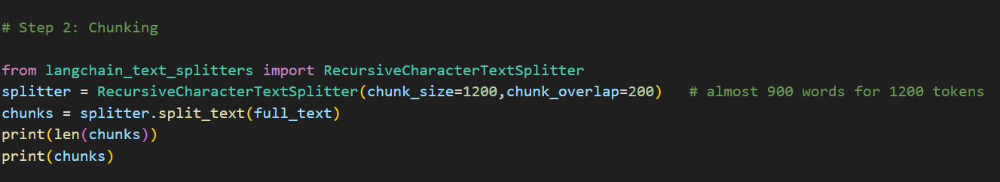
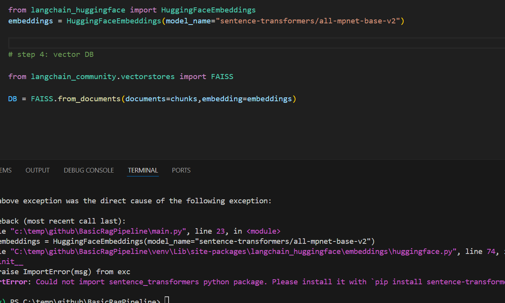
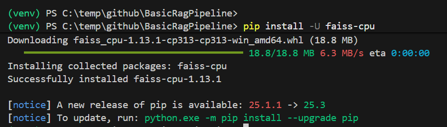
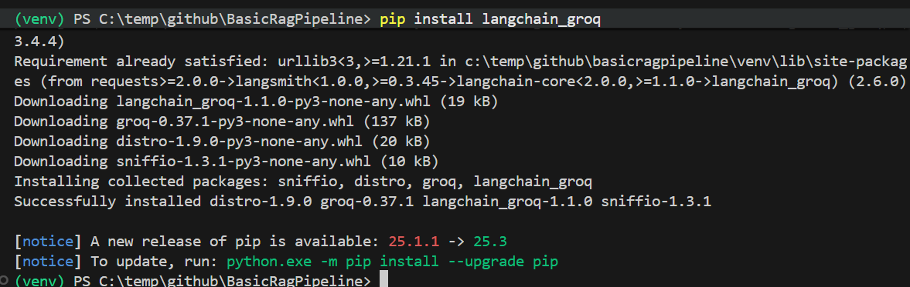

1. setting up the Virtual environment
2. installing langchain package - `pip install -U langchain`

pip install langchain_community

# https://docs.langchain.com/oss/python/langchain/overview

for step 3, installing langchain module which has embedding from huggingface, 

for step 4, loading into vector database

FAISS
chroma DB

how a vector DB will be ?

it will have a ID / chunk id, 
chunks ( english text, which we got from splitters )
embeddings for the corresponding chunks
metadata ( optional, for ex we load the data from multiple pdf)

so in general, this will be the 4 columns the vector database will have

we just need to provide these things to vector database ( chunks [document objects ],embedding model ( using the embedding model we provided, it will convert the chunks into embedding, ))

what if we had chunk size = 5000, but the model can only hold 1000, it can embed, but it will struggle to retrieve ( dense)

we pass the model again when retrieval because it has to make embeddings for the query

as retriever -> checks against database
like it finds chunks related to the query,
for sample, top k -4 ( cosine similarity)

`Cosine similarity Score` is a metric that measures the similarity between two non-zero vectors in a multi-dimensional space
in short - comparison between two words' meanings

## open source model created - to use LLM model 

https://console.groq.com/keys

tomakeRAGtestpipeline
 
re ranking - getting top k based on

what I have learned

- data ingestion
- data chunking
- embedding
- load to vector store
- retrieval ( similarity retrieval, MMR retrieval - relevant and diverse, top k)
- augmentation ( model calling and inferencing. temperature, api key, prompt ( character))

Maximal Marginal Relevance, a technique used in information retrieval and search systems to present results that are both highly relevant to a query and diverse, thereby avoiding redundancy. 